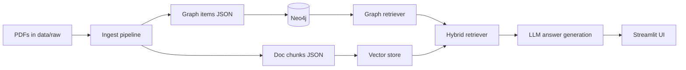

# Architecture

This document summarizes the GraphRAG architecture for the Honeywell HVAC demo.

## System overview

## Core components

- Ingest: parses PDFs, extracts entities/relations, writes graph items JSON.
- Graph store: Neo4j graph with provenance on edges.
- Retrieval: graph-only, vector-only, or hybrid (graph + vector).
- LLM: generates final answers from structured evidence.
- UI: Streamlit app for interactive queries and evidence export.

## Data flow

1. PDFs are parsed and normalized into graph items JSON.
2. Graph items are loaded into Neo4j.
3. Queries run through graph/vector/hybrid retrieval.
4. Evidence is assembled and passed to the LLM.
5. Streamlit displays answers and evidence exports.
